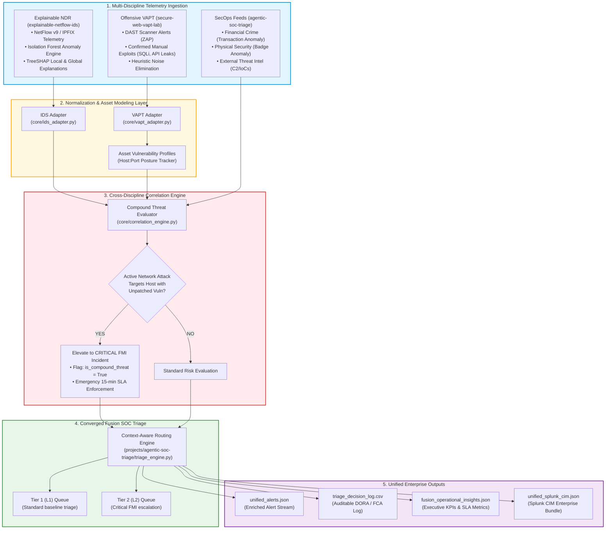
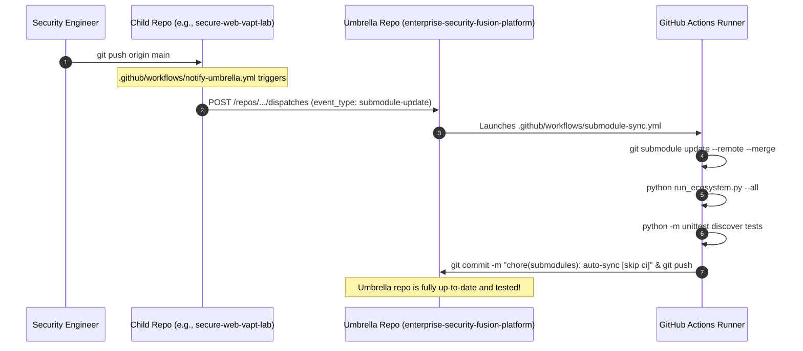

# Enterprise Security Fusion Platform

[](https://www.python.org/)
[]()
[]()
[-brightgreen.svg)]()
[]()
[]()
[](LICENSE)

> **The Umbrella Metarepository uniting Offensive Security (DAST), Network Detection & Response (NDR + TreeSHAP XAI), and Converged Security Operations (SOC Triage & FMI Routing).**  
> Engineered with **cross-discipline threat correlation** and **event-driven CI/CD synchronization**: any commit pushed to a child repository automatically updates the umbrella project, triggers integration validation, and advances version pointers.

---

## 1. Executive Summary & Value Proposition

Modern cybersecurity operations in high-consequence environments—such as **Financial Markets Infrastructure (FMI)** and capital markets backbones—cannot afford fragmented tooling. Disjointed alert streams create severe blind spots: an intrusion detection system (IDS) may log low-level network probing, while vulnerability scanners log an unpatched critical injection flaw on the same server, yet neither tool alone triggers an emergency response.

The **Enterprise Security Fusion Platform** solves this by unifying three purpose-built security engineering systems into a single synchronized ecosystem:

| Subsystem | Repository | Domain | Role & Core Capability |
| :--- | :--- | :--- | :--- |
| **Offensive VAPT** | [`secure-web-vapt-lab`](https://github.com/usman-masthan/secure-web-vapt-lab) | DAST & Web Security | Evaluates containerized web assets (OWASP Juice Shop), performs heuristic false-positive elimination (30% noise reduction), models asset vulnerability posture, and standardizes findings into Splunk CIM Vulnerabilities. |
| **Explainable NDR** | [`explainable-netflow-ids`](https://github.com/usman-masthan/explainable-netflow-ids) | Network Detection & Response | Analyzes high-throughput NetFlow v9/IPFIX sessions using an unsupervised Isolation Forest, explains behavioral anomalies via TreeSHAP mathematical attributions, and bounds alert fatigue ($\le 3\%$ FPR). |
| **SecOps Fusion Core** | [`agentic-soc-triage`](https://github.com/usman-masthan/agentic-soc-triage) | Incident Triage & SLA Routing | Ingests multi-discipline telemetry (Cyber, FinCrime, Physical, Threat Intel), evaluates compound threat risk against FMI asset criticality, dynamically routes to Tier 1 / Tier 2 queues with SLAs (15m–120m), and produces auditable regulatory logs. |

---

## 2. End-to-End System Architecture



---

## 3. Automated Cross-Repository Synchronization

A primary requirement of the ecosystem is that **a commit pushed to any child repository must immediately update the umbrella main repository**.



### How It Works:
1. **Child-to-Parent Dispatch Trigger**:
   - Each child repository includes `.github/workflows/notify-umbrella.yml` (available as a template in [`.github/workflows/templates/notify-umbrella.yml`](.github/workflows/templates/notify-umbrella.yml)).
   - When code is pushed to `main` in `agentic-soc-triage`, `explainable-netflow-ids`, or `secure-web-vapt-lab`, GitHub Actions fires a `repository_dispatch` event to the umbrella repository.
2. **Umbrella Auto-Sync & Verification Workflow**:
   - [`.github/workflows/submodule-sync.yml`](.github/workflows/submodule-sync.yml) listens for `repository_dispatch`, runs an hourly cron backup (`cron: '0 * * * *'`), and supports manual one-click execution (`workflow_dispatch`).
   - It runs `git submodule update --init --recursive --remote --merge` to fast-forward all submodules to their newest upstream commits.
   - It executes the full integration suite (`test_fusion_integration.py`) and pipeline runner (`run_ecosystem.py --all`).
   - If changes are detected, it automatically commits and pushes the updated submodule pointers directly to `main`.

---

## 4. Cross-Discipline Threat Correlation in Action

Consider this live operational scenario executed by `core/correlation_engine.py`:

```
[VAPT Finding Ingestion]
  Host: 127.0.0.1:3000
  Active Vulnerabilities:
    - VULN-01: Authentication Bypass via SQL Injection (CVSS 9.8 Critical)
    - VULN-02: Sensitive Internal API Exposure (CVSS 7.5 High)
    - VULN-03: Overly Permissive CORS (CVSS 6.5 Medium)

[NDR Anomaly Detection]
  Source IP: 203.0.113.88 ──► Destination: 127.0.0.1:3000
  Rule: Volumetric SYN Flood / DoS Attempt (MITRE T1498.001)
  TreeSHAP Justification: packets_per_second (+2.89) is 45x benign baseline; TCP flags strictly SYN (+1.20).

[Cross-Correlation Engine Verdict]
  ⚡ COMPOUND THREAT DETECTED: Active network burst is targeting host 127.0.0.1:3000
  Host possesses 3 unpatched vulnerabilities (Max CVSS: 9.8).
  Result: Dynamic escalation to CRITICAL FMI INCIDENT.
  Routing: Tier 2 (L2) Senior Queue | SLA: 15 Minutes Emergency Target.
```

---

## 5. Repository Structure

```
enterprise-security-fusion-platform/
├── .github/
│   ├── workflows/
│   │   ├── submodule-sync.yml         # Auto-sync submodule pointers on dispatch/schedule
│   │   ├── ecosystem-ci.yml           # Unified CI test suite across all 3 modules
│   │   └── templates/
│   │       └── notify-umbrella.yml    # Dispatch action snippet for child repos
├── .gitmodules                        # Configured submodules pointing to GitHub remotes
├── projects/
│   ├── agentic-soc-triage/            # Submodule 1: git@github.com:usman-masthan/agentic-soc-triage.git
│   ├── explainable-netflow-ids/       # Submodule 2: git@github.com:usman-masthan/explainable-netflow-ids.git
│   └── secure-web-vapt-lab/           # Submodule 3: git@github.com:usman-masthan/secure-web-vapt-lab.git
├── core/
│   ├── __init__.py
│   ├── schemas.py                     # Normalized data contracts (FusionAlert, AssetProfile)
│   ├── vapt_adapter.py                # Adapts ZAP/VAPT records to Fusion Alert Schema
│   ├── ids_adapter.py                 # Adapts NetFlow IDS + TreeSHAP explanations to Fusion Alert Schema
│   ├── correlation_engine.py          # Cross-discipline threat & vulnerability correlation engine
│   └── fusion_orchestrator.py         # End-to-end coordinator running all 3 subsystems
├── data/
│   └── unified_output/                # Central output directory for enterprise reports
│       ├── unified_alerts.json        # Merged & enriched alert stream
│       ├── triage_decision_log.csv    # Consolidated SOC triage audit log
│       ├── fusion_operational_insights.json # Executive KPI metrics & SLA tracking
│       └── unified_splunk_cim.json    # Combined CIM Vulnerabilities & Network Traffic events
├── tests/
│   ├── __init__.py
│   └── test_fusion_integration.py     # End-to-end integration and correlation verification tests
├── docker-compose.yml                 # Multi-service stack (Juice Shop, Streamlit IDS UI, SOC Dashboard)
├── run_ecosystem.py                   # Master CLI runner with options (--all, --vapt, --ids, --sync)
├── Makefile                           # Convenience targets (make setup, make test, make run, make sync)
├── requirements.txt                   # Top-level dependencies uniting the ecosystem
└── README.md                          # Comprehensive Architecture & Operations Manual
```

---

## 6. Quickstart & Execution

### 1. Clone with Submodules
```bash
git clone --recurse-submodules https://github.com/usman-masthan/enterprise-security-fusion-platform.git
cd enterprise-security-fusion-platform
```
*(If cloned without `--recurse-submodules`, initialize them via `git submodule update --init --recursive`)*

### 2. Run the Full Unified Pipeline
```bash
python3 run_ecosystem.py --all
```

**Expected Terminal Output:**
```
================================================================================
                      EXECUTIVE OPERATIONAL DASHBOARD
================================================================================
 Total Ingested Alerts : 25
 Tier 1 (L1) Queue     : 14    | Standard triage & routine baseline
 Tier 2 (L2) Queue     : 11    | Escalated FMI & senior analyst investigation
 Escalation Rate       : 44.0%
--------------------------------------------------------------------------------
 SEVERITY PROFILE:
   - Critical : 5
   - High     : 5
   - Medium   : 6
   - Low      : 5
--------------------------------------------------------------------------------
 TARGET SLA COMMITMENTS:
   - 120 mins   : 9 incidents
   - 15 mins    : 5 incidents
   - 30 mins    : 5 incidents
   - 60 mins    : 6 incidents
--------------------------------------------------------------------------------
 COMPOUND CROSS-DISCIPLINE THREATS: 2 DETECTED
   [1] Active Attack: NetFlow Anomaly: Port Scan & Service Sweep on 127.0.0.1:3000
       Vulnerable Vectors: Authentication Bypass via SQL Injection, Sensitive API Leak
       Action: IMMEDIATE L2 ESCALATION (15-min SLA)
   [2] Active Attack: NetFlow Anomaly: Volumetric SYN Flood / DoS on 127.0.0.1:3000
       Vulnerable Vectors: Authentication Bypass via SQL Injection, Sensitive API Leak
       Action: IMMEDIATE L2 ESCALATION (15-min SLA)
================================================================================
```

### 3. Run Integration Tests
```bash
python3 -m unittest discover -s tests -p "test_*.py" -v
```

### 4. Sync Submodules to Latest Remote Commits
```bash
python3 run_ecosystem.py --sync
# or: make sync
```

### 5. Multi-Service Container Stack (Docker Compose)
Launch the containerized OWASP Juice Shop web target, Streamlit NetFlow IDS analytics dashboard, and SOC Fusion pipeline together:
```bash
docker-compose up -d
```
- **OWASP Juice Shop**: `http://localhost:3000`
- **Explainable NetFlow IDS Dashboard**: `http://localhost:8501`

---

## 7. Compliance & Regulatory Alignment

The generated audit logs and operational reports directly support mandatory compliance frameworks governing Financial Markets Infrastructure and enterprise financial institutions:

- **Digital Operational Resilience Act (DORA - Regulation EU 2022/2554)**: Article 9 & 10 ICT incident management, logging, and SLA detection controls.
- **UK FCA / PRA Operational Resilience**: Proves compound cross-vector risk quantification and MTTR bounding for core business services.
- **SOC 2 Type II (Trust Services Criteria)**: CC7.2 (Security event monitoring) and CC7.3 (Incident triage, analysis, and containment documentation).

---

## 8. License

This umbrella project and its orchestration architecture are distributed under the [MIT License](LICENSE). Individual submodules retain their respective open-source licensing.

